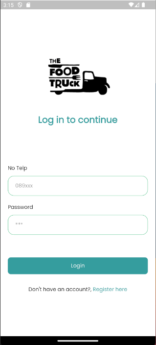
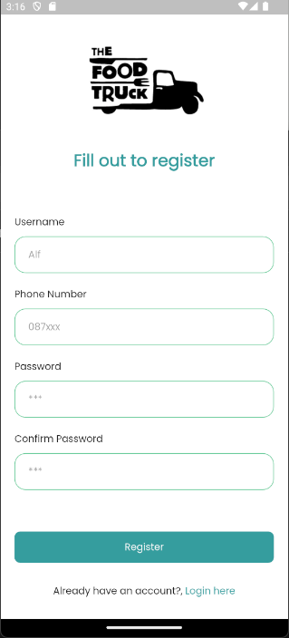
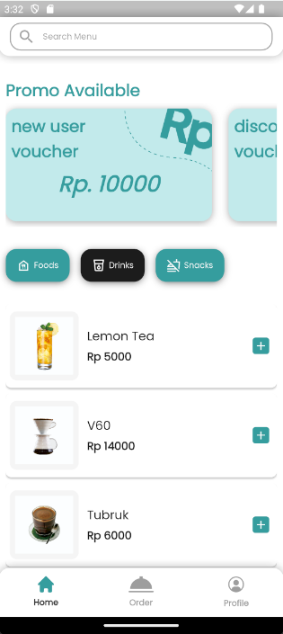
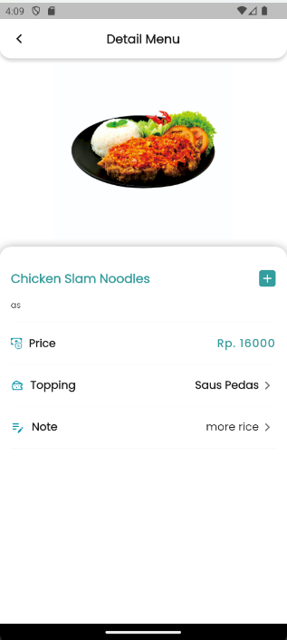
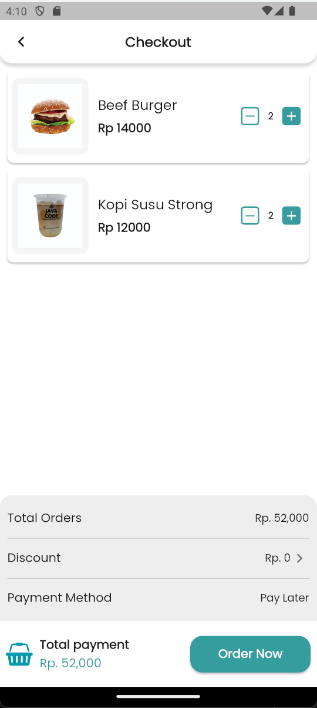
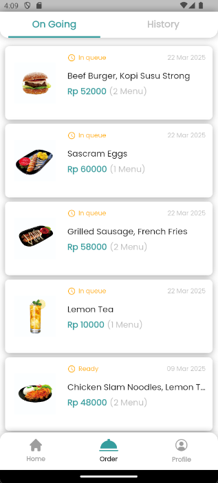

# Food Rush

FoodRush is a fast and intuitive food delivery application designed to offer users a seamless experience in ordering food. The app allows customers to browse menus, place orders, and receive timely deliveries, all from the comfort of their homes. FoodRush aims to deliver convenience and speed, ensuring a satisfying experience for both users and restaurant partners.


Flutter project that applies the MVC method with Getx and backend api using laravel 11 for database using postgreSQL.

## Preview aplication
|Login View|RegisterView|
|----------|------------|
|||
|Home view|Detail Menu|
|||
|Checkout view|History Order|
|||


## Setup
first you have to create a laravel and flutter project, after that make flutter project to parent and laravel project to child like this :
```
food_rush/
│
├── android/
│
├── ios/
│
├── lib/
│
├── test/
│
├── web/
│
├── backend/
│   ├── app/
│   ├── bootstrap/
│   ├── config/
│   ├── database/
│   ├── public/
│   ├── resources/
│   ├── routes/
│   ├── storage/
│   ├── tests/
│   ├── vendor/
│   ├── .env
│   ├── artisan
│   ├── composer.json
│   ├── package.json
│   ├── phpunit.xml
│   ├── README.md
```
after that you have to make a api in laravel and connect to flutter, you can use postman to test your api, and then you can use flutter to connect to your api.

note: 

- Make sure you run php artisan serve to start your laravel server. for emulator you can use 10.0.2.2.
- For database you can use mysql or sqlite, for this project i use postgresql.
- This flutter use getx for state management. if you don't know how to use Getx, you can learn it from [Getx](https://pub.dev/packages/get).

